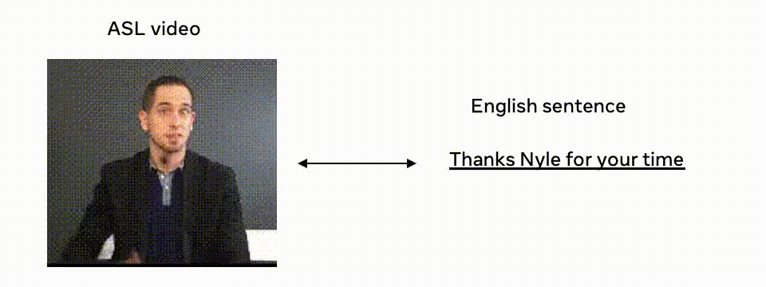

# OpenASL: A Large-Scale Open-Domain Sign Language Translation Dataset


## Instructions
This repo contains OpenASL dataset proposed in paper: [Open-Domain Sign Language Translation Learned from Online Video](https://arxiv.org/abs/2205.12870)

If you use OpenASL data in your research, please use the following BibTeX entry for citation.

```BibTeX
@inproceedings{shi2022open,
  author = {Bowen Shi and Diane Brentari and Greg Shakhnarovich and Karen Livescu},
  title = {Open-Domain Sign Language Translation Learned from Online Video},
  booktitle = {EMNLP},
  year = {2022}
}
```

## Instructions
### 1. Download videos
Run the following command to download videos into `/path/to/raw-video`.
```
python prep/download.py --tsv data/openasl-v1.0.tsv --dest /path/to/raw-video
```

If you are on slurm, you can parallelize the video downloading with the following command:

``` 
python prep/download.py --tsv data/openasl-v1.0.tsv --dest /path/to/raw-video --nshard ${nshard} --slurm
```

where `${nshard}` is the number of jobs to launch. The slurm arguments can be modified via `--slurm-argument '{"slurm_array_parallelism":100,"slurm_partition":"cpu","timeout_min":240,"slurm_mem":"16g"}'`. Note some videos may no longer be publicly available. 

### 2. Video preprocessing
The following command will trim the raw video into clips and spatially crop the video clips.


```
python prep/crop_video.py --tsv data/openasl-v1.0.tsv --bbox data/bbox-v1.0.json --raw /path/to/raw-video --output /path/to/video-clip --ffmpeg /path/to/ffmpeg
```

The processed video will be saved into `/path/to/video-clip`. `data/bbox-v1.0.json` contains the person bounding box of each video clip in the format of `[x0,y0,x1,y1]` normalized by the image width and height. Note the bounding boxes are generated based on face detection plus some heuristic processing and are not proofread by humans. Roughly the error rate is below `1%`.

Similar to step 1, you can parallelize this step on slurm.

```
python prep/crop_video.py --tsv data/openasl-v1.0.tsv --bbox data/bbox-v1.0.json --raw /path/to/raw-video --output /path/to/video-clip --ffmpeg /path/to/ffmpeg --slurm --nshard ${nshard}
```

## License
OpenASL is licensed under the Creative Commons BY-NC-ND 4.0 License - see [LICENSE](LICENSE.md) for more details. 
